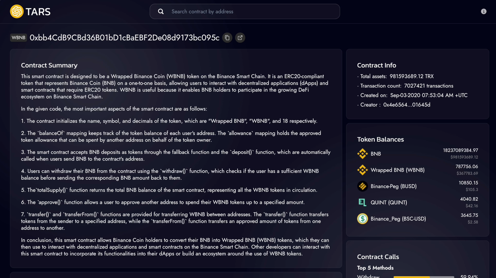

# TARS: AI-Powered Blockchain Data Interpretation

TARS is an application designed to interpret blockchain data, particularly smart contracts on the EVMOS. It utilizes GPT-based models to translate complex contract information into a format that is easily digestible for non-technical users.

## Features

- Translates smart contract addresses into non-technical language
- Detailed ethers and wagmi implementation for dapp developers
- Detailed contract insights (token balance, methods) for developers
- User-friendly UI/UX for seamless experience

## Limitations

- Currently only supports contract interpretation for v1
- Performance issues may occur due to latency on GPT-4 model API
- Limited to interpreting small-sized contracts less than 4096 tokens 

## Tech Stack
- React
- Express
- Covalent API
- Puppeteer
- Mintscan EVMOS
- GPT-4 API by OpenAI

## Roadmap
- Expand features to interpret accounts and transactions, trace transfers to identify scams
- Add more features to contract interpretation like assessing vulnerabilities in the contract logic

## How to test
1. Go to [tarsgpt.app](https://tarsgpt.vercel.app/)
2. Search for a verified, digestible contract on the EVMOS. Some good examples of popular contracts on EVMOS:
   1. Wrapped EVMOS Contract: [0xD4949664cD82660AaE99bEdc034a0deA8A0bd517](https://www.mintscan.io/evmos/evm/contract/0xD4949664cD82660AaE99bEdc034a0deA8A0bd517)
   2. eDOGE Contract: [0x93D8c966d8dD358fe5146ad3067a0414f25f7F5B](https://www.mintscan.io/evmos/evm/contract/0x93D8c966d8dD358fe5146ad3067a0414f25f7F5B)
   3. Evoki Contract: [0xf7bf11bEa084A44dF6A2a2049FeDb5Bb88FBA109](https://www.mintscan.io/evmos/evm/contract/0xf7bf11bEa084A44dF6A2a2049FeDb5Bb88FBA109)
   4. APEMOS Contract: [0x88361F09F8c93283e76b8efE2A0d5FC4cBEb97a9](https://www.mintscan.io/evmos/evm/contract/0x88361F09F8c93283e76b8efE2A0d5FC4cBEb97a9)
   5. eMOON Contract: [0x4490B2c9066D46C2588379B9D92F24De9a281ed6](https://www.mintscan.io/evmos/evm/contract/0x4490B2c9066D46C2588379B9D92F24De9a281ed6)
3. See TARS interpretation of contract

Note: The contract you are searching for MUST be (1) verified, (2) small enough that the GPT-4 modal can digest. Failing to do so by the requirements may cause the server to throw an error.