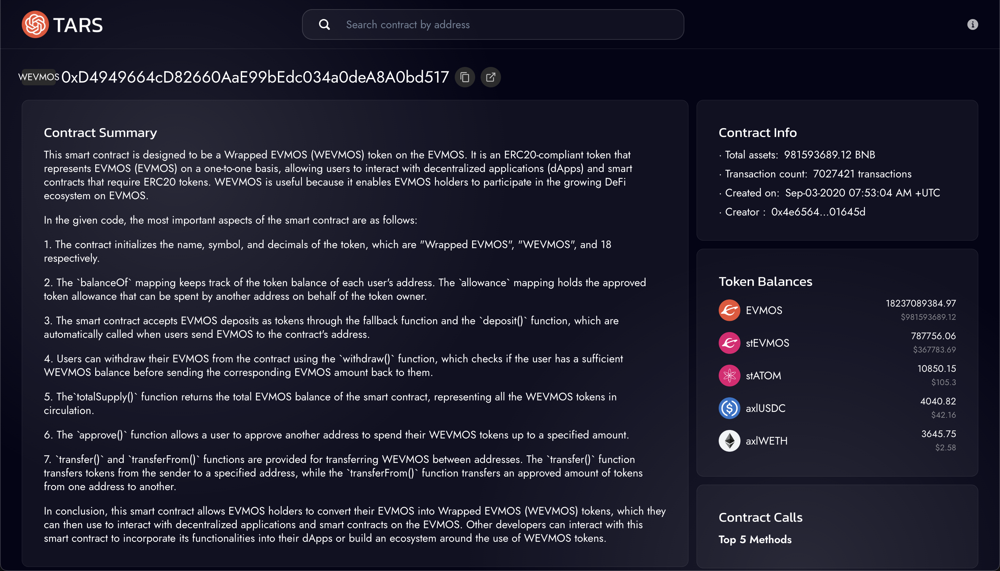

# TARS: AI-Powered Blockchain Data Interpretation

TARS is an application designed to interpret blockchain data, particularly smart contracts on the BNB Chain. It utilizes GPT-based models to translate complex contract information into a format that is easily digestible for non-technical users.

## Features

- Translates smart contract addresses into non-technical language
- Detailed contract insights for developers
- User-friendly UI/UX for seamless experience
- Integration with BNB Chain via BscScan API

## Limitations

- Currently only supports contract interpretation for v1
- Performance issues may occur due to latency on GPT-4 model API
- Limited to interpreting small-sized contracts less than 4096 tokens 

## Roadmap
- Expand features to interpret accounts and transactions
- Add more features to contract interpretation like assessing vulnerabilities in the contract logic

## How to test
1. Go to [tarsgpt.xyz](https://tarsgpt.xyz)
2. Search for a verified, digestible contract on the BNB Chain. Some good examples:
   1. Wrapped BNB Contract: [0xbb4CdB9CBd36B01bD1cBaEBF2De08d9173bc095c](https://bscscan.com/token/0xbb4CdB9CBd36B01bD1cBaEBF2De08d9173bc095c#code)
   2. CAKE Token Contract: [0x0e09fabb73bd3ade0a17ecc321fd13a19e81ce82](https://bscscan.com/address/0x0e09fabb73bd3ade0a17ecc321fd13a19e81ce82#code)
3. See TARS interpretation of contract

Note: The contract you are searching for MUST be (1) verified, (2) small enough that the GPT-4 modal can digest. Failing to comply by the requirements may cause the server to throw an error.